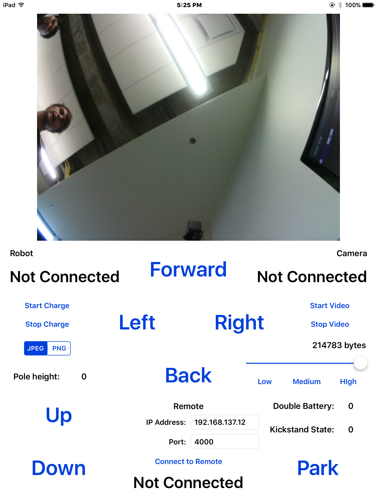

# Double Robot Remote Client

An iOS client application written in Swift that integrates with the API of a [Double Telepresence Robot](https://www.doublerobotics.com) to access camera data and control the robot. 

The application is now being used in various research studies at the University of Manitoba's Human-Robot Interaction Lab.

This "client" application works in conjunction with a [desktop "server" application](https://github.com/NickJosephson/Double-Robot-Remote-Server) to allow this desktop application to controll the robot and receive a video feed from the robot's camera that can be processed on the desktop application.

This is part of a project to prototype robot tele-operation interfaces for visually impaired drivers, to enable this population to benefit from tele-robotics.

